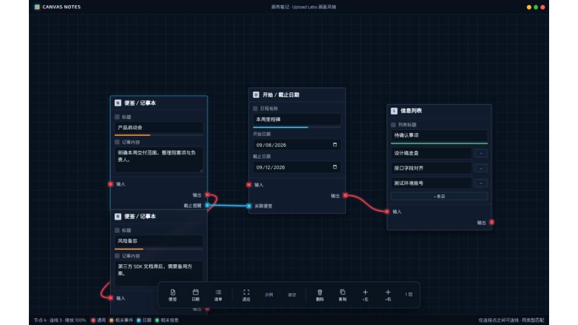
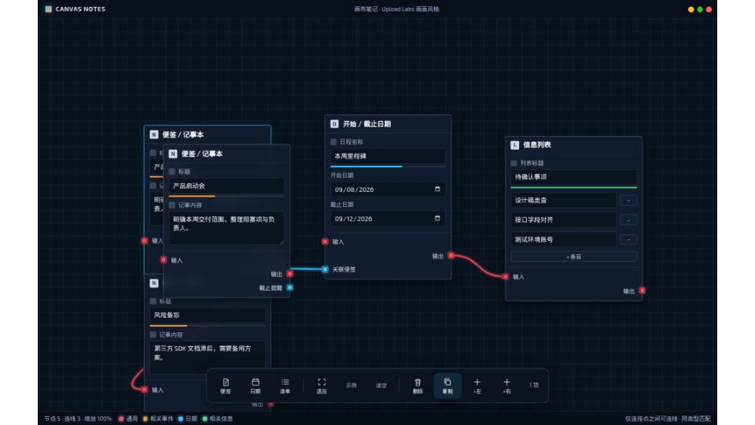

<div align="center">

# 画布笔记 | CanvasNotes

[](https://www.typescriptlang.org/)
[](https://www.electronjs.org/)
[](LICENSE)
[](#)

---

面向本地使用的 **画布笔记 / 待办** 桌面客户端（Windows EXE）。

节点外观参考 **Upload Labs** 窗口式卡片，连线方式参考 **ComfyUI**（仅连接点之间、贝塞尔曲线）。无边框独立窗口，双击即可运行，**无需浏览器**；数据保存在本机。

<br/>



</div>

---

## 功能概览

| 功能 | 说明 |
| :--- | :--- |
| Windows 独立客户端 | 打包为 `.exe`，安装版 / 绿色便携版均可 |
| 便签 / 记事本 | 标题 + 正文，适合会议纪要与短备忘 |
| 开始 / 截止日期 | 日程名称 + 起止日期 |
| 信息列表 | 可增减条目的清单节点 |
| 自定义连接点 | 左右侧端口：通用 / 相关事件 / 日期 / 相关信息 |
| 通用互通 | **红色通用**可与任意类型连接；其他类型需同色匹配 |
| 多连线 | 同一连接点可接到多个其他连接点 |
| 方向约束 | 仅允许不同卡片的左 ↔ 右；禁止自连与同侧连线 |
| 底部工具栏 | Upload Labs 风格悬浮菜单；选中后显示删除 / 复制 / +左 / +右 |
| 画布操控 | 左键拖空白平移、滚轮缩放、适应视图 |
| 无边框窗口 | 自绘标题栏（最小化 / 最大化 / 关闭） |
| 本地持久化 | 自动写入本机存储 |

---

## 界面预览

### 选中卡片与底部菜单

选中节点后，底部 dock 出现 **删除、复制、+左、+右** 等上下文操作。



### 新建连接点

通过 **+左 / +右** 打开对话框；默认类型为 **通用（红色）**。


---

## 快速开始

### 方式一：下载 Release（推荐）

1. 前往 [Releases](https://github.com/kamuxiy/CanvasNotes/releases) 下载最新 Windows 包
2. 任选其一：
   - **便携版**：`画布笔记-*-portable.exe` — 解压/下载后直接双击运行
   - **安装版**：`画布笔记-*-Setup.exe` — 按向导安装后从桌面快捷方式启动
3. 启动后即可在独立客户端窗口中编辑画布（无需打开浏览器）

> 首次如被 SmartScreen 拦截，选择「仍要运行」（开源自建包常见提示）。

### 方式二：源码运行（开发）

```bash
git clone https://github.com/kamuxiy/CanvasNotes.git
cd CanvasNotes

npm install
npm run dev:desktop
```

会启动 Vite 渲染进程与 **Electron 桌面窗口**（不是用浏览器当主界面）。

### 方式三：本地打包 Windows EXE

在 Windows 上：

```bash
npm install
npm run dist:win
```

产物输出到 `release/`：

| 文件 | 说明 |
| :--- | :--- |
| `画布笔记-*-portable.exe` | 绿色便携版，双击即用 |
| `画布笔记-*-Setup.exe` | NSIS 安装包 |

也可在仓库 Actions 中手动触发 **Build Windows Client**，或推送 `v*` 标签自动构建并发布 Release。

---

## 环境依赖

| 项目 | 要求 | 说明 |
| :--- | :--- | :--- |
| 操作系统 | Windows 10 / 11（64 位） | 正式客户端目标平台 |
| 运行方式 | 下载 EXE | Release 已内置运行时，无需预装 Node / 浏览器 |
| Node.js | 20+ | **仅**源码开发或自行打包时需要 |
| npm | 随 Node 附带 | 安装依赖与执行打包脚本 |

### 主要依赖（源码）

| 库 | 作用 |
| :--- | :--- |
| [Electron](https://www.electronjs.org/) | 桌面壳与无边框窗口 |
| [React](https://react.dev/) | 界面 |
| [Vite](https://vite.dev/) | 渲染进程构建 |
| [TypeScript](https://www.typescriptlang.org/) | 类型与构建 |
| [Tailwind CSS](https://tailwindcss.com/) | 样式工具链 |
| [electron-builder](https://www.electron.build/) | 打包 Windows EXE |
| [uuid](https://github.com/uuidjs/uuid) | 节点 / 连接点 ID |

---

## 项目结构

```
CanvasNotes/
├── electron/
│   ├── main.cjs                 # Electron 主进程（独立窗口、单实例）
│   └── preload.cjs              # 预加载：窗口控制桥
├── src/                         # 渲染进程 UI
│   ├── App.tsx
│   ├── components/
│   │   ├── BottomDock.tsx
│   │   ├── CanvasBoard.tsx
│   │   ├── NodeCard.tsx
│   │   ├── SocketPort.tsx
│   │   ├── SocketDialog.tsx
│   │   └── TitleBar.tsx
│   ├── hooks/useCanvasStore.ts
│   ├── store.ts
│   └── types.ts
├── build/                       # electron-builder 资源（图标等）
├── .github/workflows/
│   └── build-windows.yml        # 自动打包 Windows EXE
├── docs/images/                 # README 配图
├── package.json
└── release/                     # 本地打包输出（不入库）
```

---

## 使用说明

### 画布操作

| 操作 | 说明 |
| :--- | :--- |
| 底部「便签 / 日期 / 清单」 | 在视口中心附近添加节点 |
| 左键拖空白处 | 平移画布 |
| 滚轮 | 缩放 |
| 拖节点标题栏 | 移动节点 |
| 从连接点拖出 | 拉线到另一侧连接点 |
| 双击连接点 | 重命名 |
| 右键连接点 | 删除该连接点 |
| 点击连线 | 删除连线 |
| Delete / Backspace | 删除选中节点 |
| 适应 | 将全部节点适配进视口 |

### 连线规则

| 规则 | 说明 |
| :--- | :--- |
| 方向 | 仅 **左 ↔ 右**（输入 ↔ 输出），跨不同卡片 |
| 自连 | 同一卡片不允许自连 |
| 同侧 | 左连左、右连右不允许 |
| 通用（红） | 可与任意颜色类型互连 |
| 其他类型 | 仅同类型互连 |
| 多连 | 一个连接点可接到多个目标；不会挤掉已有连线 |

### 选中与底部菜单

1. 点击卡片标题栏选中（Shift 可多选）
2. 底部出现 **删除 / 复制**；单选时另有 **+左 / +右**
3. **+左 / +右** 打开「新建连接点」对话框（默认类型为通用）

---

## 参考与致谢

### 参考项目 / 设计

| 项目 | 用途 |
| :--- | :--- |
| [Upload Labs](https://store.steampowered.com/app/2764070/Upload_Labs/) | 窗口式模块卡片、边缘端口与底部工具栏观感参考 |
| ComfyUI | 仅端口连线、贝塞尔曲线交互参考 |

### 特别感谢

- 感谢 Upload Labs 的模块化节点与底部 dock 交互启发
- 感谢 ComfyUI 社区的节点连线范式
- 感谢 Electron / React / Vite / electron-builder 等开源工具链维护者

### 开源协议

本项目使用 [MIT License](LICENSE)：

- 允许个人与商业使用、修改、分发
- 分发须保留版权声明与许可文本
- 软件按「原样」提供，不附带担保

---

## 反馈

- Bug / 建议：[Issues](https://github.com/kamuxiy/CanvasNotes/issues)
- 客户端下载：[Releases](https://github.com/kamuxiy/CanvasNotes/releases)

---

<div align="center">

Made by kamuXiY

画布笔记 · Windows 桌面客户端 · Electron + React

</div>
